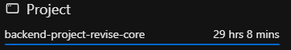

# VidEngine - Video Platform Backend

## Project Overview
VidEngine is a robust backend system for a video-sharing platform, similar to YouTube. It provides a complete API infrastructure for managing videos, user interactions, and social features.

## Core Technologies
- **Runtime:** Node.js
- **Framework:** Express.js
- **Database:** MongoDB with Mongoose ODM
- **Authentication:** JWT (JSON Web Tokens)
- **File Storage:** Cloudinary
- **File Handling:** Multer

## Project Time  
  
The total time spent on the project is 29 hours and 8 minutes.


## Documentation & Resources

- **Documentation:** [VidEngine Documentation](Documentation.md)
- **Postman Collection:** [Postman Collection](backend.postman_collection.json)
- **API Base URL:** [http://localhost:3000/api/v1/](http://localhost:3000/api/v1/)
- **GitHub Repository:** [Syed Tasavour](https://github.com/syedtasavour/VidEngine)

## Key Features

### 1. User Management
- Complete authentication system
- Profile management with avatar and cover images
- Watch history tracking
- Channel management

### 2. Video Platform
- Video upload and management
- Thumbnail generation
- Video publishing controls
- View counting
- Duration tracking

### 3. Social Features
- Comments on videos
- Like system for videos, comments, and tweets
- Channel subscriptions
- Tweet functionality
- Playlist creation and management

### 4. Content Organization
- Custom playlists
- Video categorization
- User channels
- Watch history

## Advanced Features

### 1. Security
- JWT-based authentication
- Refresh token rotation
- Password hashing with bcrypt
- Resource ownership verification
- Input validation and sanitization

### 2. File Management
- Cloud-based file storage
- Support for video files
- Image processing for thumbnails
- Automatic cleanup of unused files

### 3. Performance
- Pagination support
- Efficient database queries
- Mongoose aggregation pipelines
- Optimized file uploads

### 4. Analytics
- Channel statistics
- View counting
- Subscriber metrics
- Engagement tracking

## Architecture Highlights

### 1. Code Organization
- MVC architecture
- Modular routing
- Middleware patterns
- Utility functions

### 2. Database Design
- Normalized schema design
- Efficient indexing
- Referential integrity
- Aggregation support

### 3. API Design
- RESTful principles
- Consistent error handling
- Standardized responses
- Proper status codes

## Development Features

### 1. Code Quality
- ESLint configuration
- Prettier formatting
- Consistent coding style
- Error handling patterns

### 2. Development Tools
- Nodemon for development
- Environment configuration
- Debug logging
- Health check endpoints

## Scalability Considerations

### 1. Database
- Indexed queries
- Efficient data structures
- Pagination implementation
- Caching possibilities

### 2. File Storage
- Cloud-based storage
- CDN integration ready
- Efficient file management
- Storage optimization

## Security Measures

### 1. Authentication
- Secure token management
- Password security
- Session handling
- Token refresh mechanism

### 2. Data Protection
- Input validation
- XSS prevention
- CORS configuration
- Rate limiting ready

## API Features

### 1. User APIs
- Authentication endpoints
- Profile management
- Password handling
- Avatar management

### 2. Video APIs
- Upload functionality
- Video management
- Thumbnail handling
- Publishing controls

### 3. Interaction APIs
- Comments system
- Like functionality
- Subscription management
- Tweet system

### 4. Organization APIs
- Playlist management
- Channel management
- Watch history
- Dashboard statistics

## Future Scope

### 1. Potential Additions
- Video processing pipeline
- Advanced analytics
- Recommendation system
- Search functionality

### 2. Scalability Options
- Caching layer
- Load balancing
- Microservices architecture
- Queue system for processing

## Project Structure
```
/src
  /controllers - Business logic
  /models - Database schemas
  /routes - API routes
  /middlewares - Custom middlewares
  /utils - Helper functions
  /config - Configuration files
  /db - Database connection
```

## Getting Started

### 1. Prerequisites
- Node.js
- MongoDB
- Cloudinary account

### 2. Installation
- Clone repository
- Install dependencies
- Configure environment
- Start development server

### 3. Configuration
- Environment variables
- Database setup
- Cloudinary setup
- API configurations

### Documentation Resources

#### 1. API Reference
- Complete API documentation
- Request/Response examples
- Authentication guide
- Error codes reference

#### 2. Postman Collection
- Ready-to-use API requests
- Environment variables
- Test examples
- Request documentation

#### 3. Integration Guides
- Quick start guide
- Authentication setup
- File upload guide
- Best practices

#### 4. Development Resources
- Environment setup guide
- Deployment instructions
- Testing guidelines
- Contribution guide

